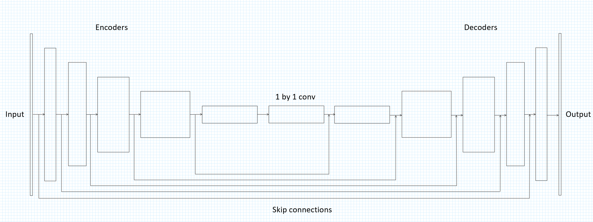
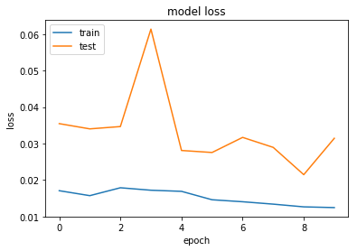
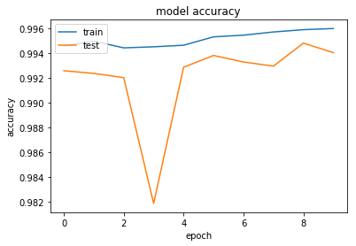

# Udacity Robotics Nanodegree - Deep Learning Project

## Introduction

The goal of the project is to train a deep neural network to identify and track
a target in simulation. To get started, I followed the instructions in the
introduction to set up the project. I used both an AWS EC2 Compute instance and
my GPU to train the networks.

## Network Architecture

If the goal of the project was to simply identify whether or not the target is
present in a given frame of the camera output of the drone, we  could use a
**Convolutional Neural Network**. A traditional CNN uses each of its layers to
learn more and more complex shapes/objects in the the image and in the final
layer, it tries to finds the object itself. For example, in the first layer, the
CNN tries to find simple shapes and edges, then in the second layer it tries to
find complex objects/shapes like stripes, circles etc and so on. In the last
layer, the CNN finds our object of interest.

For this project, we not only want to identify our target, but also need to
track the object. That is to find where in the image our target is. As discussed
in the class, Semantic Segmentation is the answer (using a Fully Convolutional
Network).

A FCN (Fully Convolutional Network) consists of a set of encoders followed by a
1x1 convolution followed by a set of decoders.

### Encoder

An encoder is a simple convolution layer. A set of encoder forms a CNN discussed
above. The following code snippet shows an encoder block using Keras.

```
def encoder_block(input_layer, filters, strides):
    
    # TODO Create a separable convolution layer using the separable_conv2d_batchnorm() function.
    output_layer = separable_conv2d_batchnorm(input_layer, filters, strides)
    
    return output_layer
```

### Decoder

A decoder block is used to upsample the images from the output of the encoder
block and 1 by 1 layer to a higher resolution. By upsampling the image multiple
times, we want to get the original size of the image back. In essence, the
decoder is trying to semantically project the lower resolution features learned
by the encoder into a higher resolution space to get a dense classification.

We can upsample the image using multiple techniques, transposed convolution and
bilinear upsampling are a couple of them discussed in the lesson. Unpoolingis
another technique widely used for semantic segmentation. For the project we used
the bilinear upsampling technique to upsample the image.

Due to how encoding works (looking at smaller and smaller patches of the image),
even when we upsample the image to the original size, some of the information is
lost. To solve this issue, we use skip connections, that is, by connecting the
output of one layer in the encoder block to an upsampled layer of the same size
in the decoder block, we can retain more information about the original image.
This is done by element wise addition operation.

The following code snippet shows an encoder block with skipped connection to the
large input layer.

```
def decoder_block(small_ip_layer, large_ip_layer, filters):
    
    # TODO Upsample the small input layer using the bilinear_upsample() function.
    upsampled = bilinear_upsample(small_ip_layer)
    output_layer = layers.concatenate([upsampled, large_ip_layer])
    
    # TODO Add some number of separable convolution layers
    output_layer = separable_conv2d_batchnorm(output_layer, filters)
    
    return output_layer
```

For the architecture, I started small, with two encoder blocks and two decoder
blocks connected by a 1x1 layer in the middle. Then to select the hyper
parameters. The main hyper parameters to choose (apart from the number of
layers) are learning rate, batch size and number of epochs.

### Learning rate

The learning rate dictates how much to update the weights during back
propagation while optimizing the model. The learning rate should be small enough
such that, while gradient descent, our optimizer does not "leap" over the
minimum. I experimented with values of 0.01, 0.005 and 0.001 but got the best
results when using 0.01. As I go on to discuss choosing the number of epochs, I
would go further into discussing how learning rate might influence the number of
epochs.

### Batch size

Batch size is the number of samples to be used per gradient update while
optimizing the model. Using really low values causes the model to overfit.
A good choice to test with is between the rage of 16 and 128. Due to the
limitation of my graphics card, the highest value of batch size I could
experiment with was 55. I also experimented for a couple of runs with 64 samples
on an AWS instance. The batch size with which I got the best result was 32
samples.

### Number of epochs

An epoch is a single pass through the entire training set. Ideally we would want
to train the model until we see the gap between the test error and training
error is small. We should usually increase the number of epochs when we reduce
either the learning rate or the batch size. It is usually ideal to decrease the
batch size and increase the number of epochs than vice versa. Large batch sizes
usually converge to large minimizers and in contrast, small batch sizes usually
converge to flat minimizers[<sup>1</sup>](https://arxiv.org/pdf/1609.04836.pdf).

I experimented with values from 5 to 50 epochs and for the run that yielded the
best result, I used 10 epochs.

### Other parameters

#### Steps per epoch

It is the number of steps to yield from generator before declaring one epoch
finished. Keras suggests the that the value should ideally be equal to the
number of total samples divided by the batch size. I experimented with the Keras
suggestion but the default value of 200 provided in the project worked best for
me.

#### Validation steps

Similar to steps per epoch, it is the number of steps to yield from the
validation generator at the end of every epoch. Keras suggests the value should
typically be equal to the number of validation samples divided by the batch
size. Again, the default value (50) suggested in the project work best for me.

#### Workers

It is the maximum number of processes to spin up. It is usually dependent on the
type of hardware that is used for training. I used the default value of 2
provided in the project.

### Network depth

The final hyper parameter that I experimented with is the network depth. As I
updated the network depth, I experimented with a wide range of hyper parameters
mentioned above.

The first network I used of two encoders and two decoders connected by a 1x1
layer yielded sub par results for any combination of the other hyper parameters.
I went on to add a layer at a time and finally landed on the following network
that yielded the best result for me. The network had 5 encoders and 5 decoders
connected by a 1x1 layer.

```
def fcn_model(inputs, num_classes):
    
    base_filters = 32

    # Remember that with each encoder layer, the depth of your model (the number of filters) increases.
    enc_layer_1 = encoder_block(inputs, filters=base_filters, strides=2)
    enc_layer_2 = encoder_block(enc_layer_1, filters=base_filters*2, strides=2)
    enc_layer_3 = encoder_block(enc_layer_2, filters=base_filters*3, strides=2)
    enc_layer_4 = encoder_block(enc_layer_3, filters=base_filters*4, strides=2)
    enc_layer_5 = encoder_block(enc_layer_4, filters=base_filters*5, strides=2)
    
    # TODO Add 1x1 Convolution layer using conv2d_batchnorm().
    layer_1x1 = conv2d_batchnorm(enc_layer_5, filters=base_filters*5, kernel_size=1, strides=1)
    
    # TODO: Add the same number of Decoder Blocks as the number of Encoder Blocks
    dec_layer_1 = decoder_block(layer_1x1, enc_layer_4, filters=base_filters*5)
    dec_layer_2 = decoder_block(dec_layer_1, enc_layer_3, filters=base_filters*4)
    dec_layer_3 = decoder_block(dec_layer_2, enc_layer_2, filters=base_filters*3)
    dec_layer_4 = decoder_block(dec_layer_3, enc_layer_1, filters=base_filters*2)
    x = decoder_block(dec_layer_4, inputs, filters=base_filters)
    
    # The function returns the output layer of your model. "x" is the final layer obtained from the last decoder_block()
    return layers.Conv2D(num_classes, 1, activation='softmax', padding='same')(x)
```

For the number of filters, I kept doubling the number of number of filters at
each level for the encoders and reduced them by half for each decoder layer.

**Figure** The model used for training


**Figure** Train and validation loss


**Figure** Train and validation accuracy


## 1 by 1 Vs Fully connected layer.

### Fully connected layer

In a Fully connected layer every neuron in the previous layer is connected to
every neuron on the next layer. Usually, the output from the convolution and
pooling layers represent high level features of the input image and the Fully
Connected layer uses these features to classify the input image into various
classes. In a Fully connected layer, the output of the convolution layer is
flattened which results in the loss of spatial information.

### 1 by 1 layer

A 1 by 1 convolution layer is a mini neural network running over the patch of
one pixel. This is a very inexpensive way of adding more layer to the network
and making them deeper and adding more parameters. An added advantage of using
convolution layer is that the spatial information is preserved while reducing
the dimensionality of the layer.

Another added advantage of using a convolutional layers over fully connected
layer is we can feed images of any size as input to our training network. In the
project we use a regular convolution with a kernel size and stride of 1 as a
1 by 1 convolutional layer.

## Limitations to the neural network

The model is currently trained to find the hero in the red shirt. To identify
new objects (a car, dog, cat etc.) the model needs to be trained against new
data. And in the process, the model hyper parameters need to be tuned again
(including the depth of the network).

Some of the limitations might be when there are multiple objects in the world
against which our model is trained, for example, in our project, we only have
our hero in red, but in the real world that might not be the case. Still, I
think, if the images have, enough detail, the model might get better at
distinguishing the details on the t-shirts itself (but using higher size images
requires more processing power) and many other distinguishing characteristics
of our target.

## Future Improvements

- Might try to grid search over the hyper parameter space to find the best
  values.
- Collect more data samples.
- Train the model on a device with more processing power (mostly to try
  increasing the depth and batch size).
